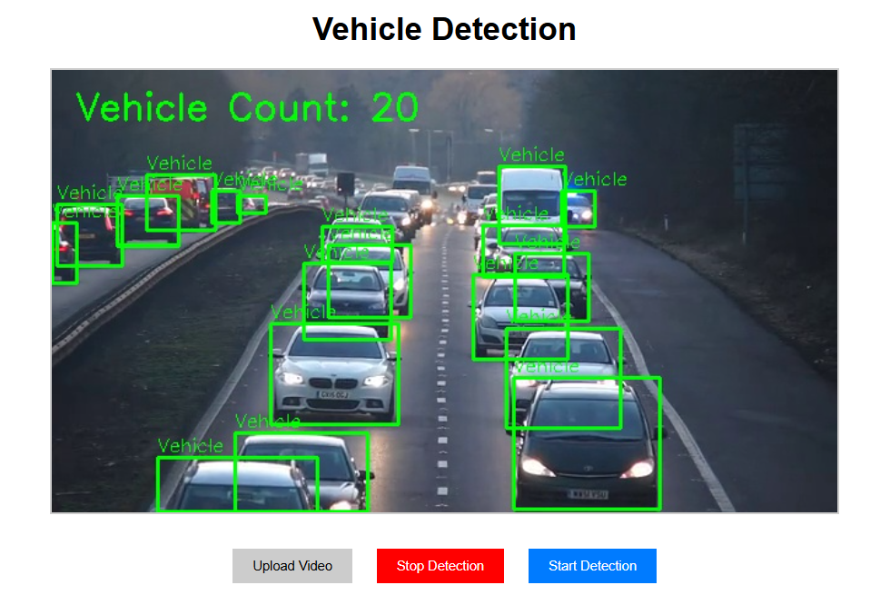

# Vehicle Detection and Counting

This project uses **YOLOv8** for real-time **vehicle detection and counting** within a custom-defined rhombus Region of Interest (ROI) on a video feed. The detection results are displayed through a user-friendly **Tkinter GUI**.

## 📽 Demo
The system processes the uploaded video (`uploads/test_file.mp4`) and displays the number of detected vehicles (cars, motorcycles, buses, and trucks) inside the rhombus area.



## 🧠 Model
- Model: [`yolov8n.pt`](https://github.com/ultralytics/ultralytics)
- Framework: [Ultralytics YOLO](https://docs.ultralytics.com/)
- Detected Classes: Car, Motorcycle, Bus, Truck (Class IDs: 2, 3, 5, 7)

## 📦 Requirements

Install required libraries:
```bash
pip install -r requirements.txt
```

### requirements.txt:
```
opencv-python
numpy
ultralytics
Pillow
```

## 📁 Folder Structure

```
vehicleDetection_Counting/
│
├── detect.py              # Main Python script with GUI
├── yolov8n.pt             # YOLOv8 model weights
├── requirements.txt       # Dependencies
├── uploads/
│   └── test_file.mp4      # Input video file
├── screenshot.png         # Example output screenshot
└── README.md              # Project readme
```

## 🔷 Region of Interest (ROI)

Vehicles are only counted if their center point lies **inside a rhombus-shaped ROI**, defined as:
```python
rhombus_roi = np.array([[80, 400], [240, 100], [400, 100], [550, 400]], np.int32)
```

## 🧑‍💻 How to Run

```bash
python detect.py
```

- The GUI will launch and start processing the video.
- Click **"Stop Detection"** to quit the GUI safely.

## ❓ Features

- ✅ Real-time vehicle detection using YOLOv8
- ✅ Tkinter-based interactive GUI
- ✅ ROI-based intelligent vehicle counting
- ✅ Highlighted bounding boxes and center markers

## 📌 Future Improvements

- Add lane-based vehicle tracking
- Real-time alert system for congestion
- Dynamic ROI drawing tool

---

### 💡 Developed by Akash Prajapati
